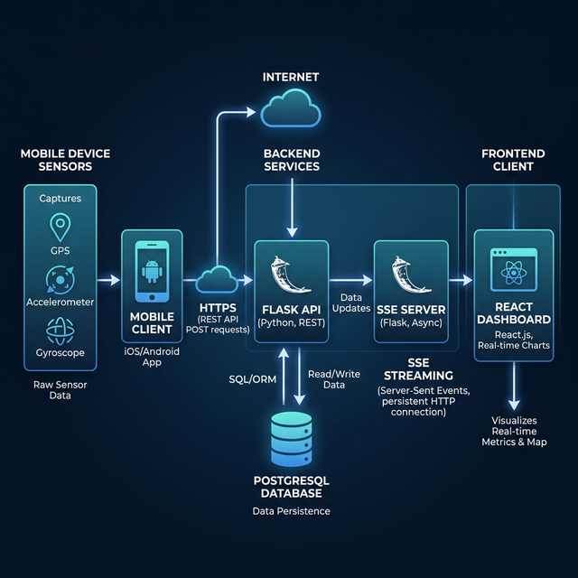
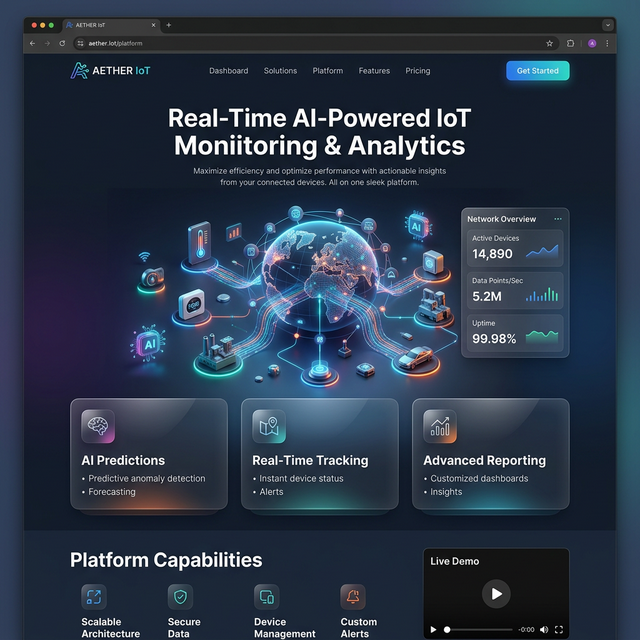
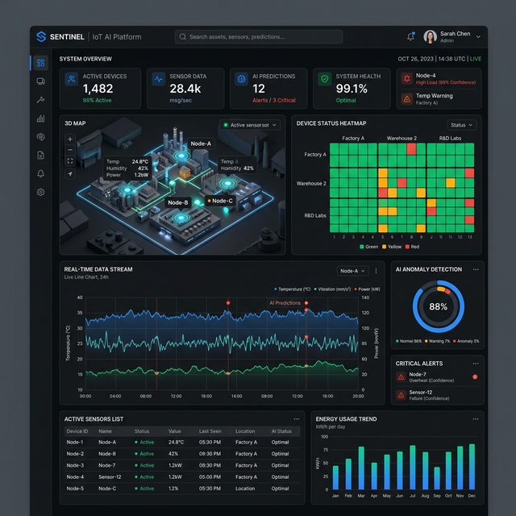
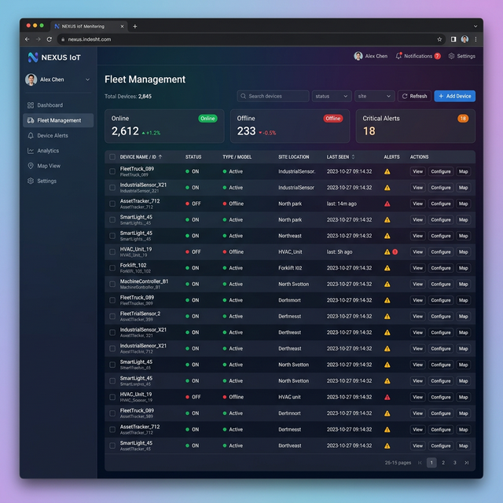
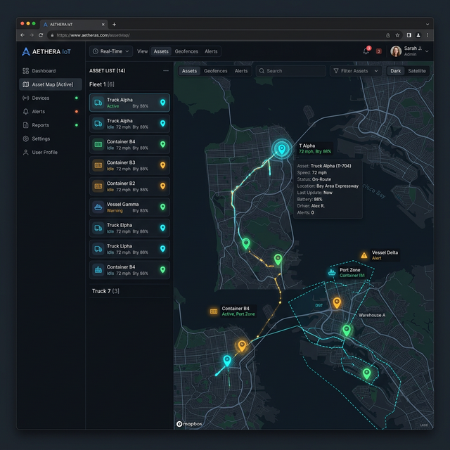
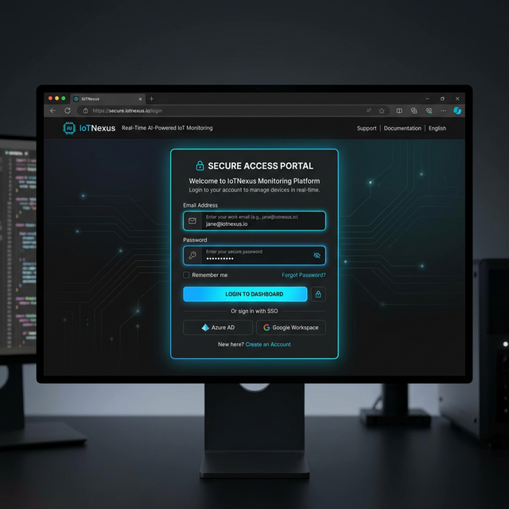

# PocketIoT

[](https://github.com/username/pocketiot/actions)
[](https://opensource.org/licenses/MIT)
[](https://nodejs.org/)
[](https://www.python.org/downloads/)

PocketIoT is a Next-Generation Real-Time AI Powered IoT Monitoring Platform tailored exclusively for comprehensive sensor telemetry intelligence. Effortlessly register devices via QR pairing, monitor asset health utilizing AI-driven IsolationForest anomaly detection, and visualize real-time geocoded metrics—all synchronized via robust Server Sent Events (SSE).

## Features

- **Mobile Device Sensor Telemetry**: Wirelessly transmit gyroscopic, geospace, ambient light, acoustic, and kinetic constraints from a mobile browser.
- **Real-Time SSE Streaming**: Low-latency dynamic dashboard sync facilitated by continuous Server Sent Events stream endpoints.
- **AI Anomaly Detection**: Integrated scikit-learn IsolationForest ML models that pinpoint magnitude-based kinematic deviations in parallel.
- **Fleet Monitoring Dashboard**: High-level telemetry aggregations exhibiting operational capabilities, component wear, and connection uptime metrics across numerous devices.
- **Asset Map with GPS Tracking**: Live geospatial projections tracking hardware modules seamlessly.
- **Live Camera Streaming**: Activate WebRTC / raw transmission to securely observe the sensor's optical lens field of view from distances afar.
- **3D Device Orientation Viewer**: Translate hardware inclination directly to a rotating rendered threejs model bridging graphical representations.
- **QR Code Device Pairing**: Simplified authentication token exchange to bridge local browsers and the remote SaaS.
- **Telemetry Analytics Dashboard**: Drill into historical plots detailing historical metric evolutions alongside alert distributions.

## System Architecture

The core topology utilizes dynamic connection nodes resolving into a centralized PostgreSQL-backed gateway. Mobile endpoints connect using zero-friction HTTPS configurations. The API resolves streams through stateless interfaces, actively evaluating AI constraints before piping successful thresholds to React frontends via SSE.



## Tech Stack

- **Frontend**: React + Vite + TailwindCSS + Three.js + Leaflet Geospatial mapping + Recharts Analytics.
- **Backend**: Python 3 (Flask API, Gunicorn)
- **Database**: SQLite (Local Development) / PostgreSQL (via Supabase for Production)
- **Real-time communication**: Python threaded Server Sent Events (SSE).
- **AI components**: `scikit-learn` (IsolationForest model buffered retasking).

## Screenshots

| Landing Page | Login Page |
|--------------|------------|
|  |  |

| System Dashboard | Fleet Management |
|------------------|------------------|
|  |  |

| Asset Map | Telemetry Analytics |
|-----------|---------------------|
|  |  |

| 3D Device Motion Viewer | Camera Streaming |
|-------------------------|------------------|
|  |  |

| QR Pairing Modal | 
|------------------|
|  |

## Installation

### Backend Setup

Navigate gracefully into the `backend` environment and launch the core systems:

```bash
cd backend
pip install -r requirements.txt
python app.py
```

### Frontend Setup

Initialize the underlying JavaScript DOM bundles via the `frontend` folder:

```bash
cd frontend
npm install
npm run dev
```

## Deployment

The architecture supports explicit division scaling via standard cloud providers:

- **Frontend → Vercel**: Supply `dist` outputs matching `VITE_API_URL` values.
- **Backend → Render**: Build against PyPI requirements and boot the app using `web: gunicorn app:app --workers 4 --threads 2`.
- **Database → Supabase**: The backend automatically interprets `DATABASE_URL` routing schemas and generates valid abstractions safely.

## Mobile Sensor Client

Syncing a device dynamically removes the need for physical provisioning:
1. Open the application dashboard and select **Pair Device**.
2. Point any generic Mobile optical scanner to the generated QR code containing initialization tokens.
3. The HTTPS portal will subsequently request permissions (Camera, Gyro, GPS) and commence telemetry bridging inherently into the user's operational group.

## API Endpoints

- `POST /api/send-data`: Bulk transmit local metrics (requires structural payload resolving x, y, z, lat, lng attributes).
- `GET /api/devices`: Retrieve an overview of registered and authenticated modules correlated to an organization.
- `GET /api/stream`: Maintain persistent multiplexed hooks tracking network alterations securely using SSE logic.
- `POST /api/device/pair`: Facilitate an exchange handshake verifying temporary one-off provisioning QR tokens against local stores.
- `GET /api/devices/<id>/history`: Extract structural history logs aggregated by the latest chronological sequences.

## License

MIT License.
